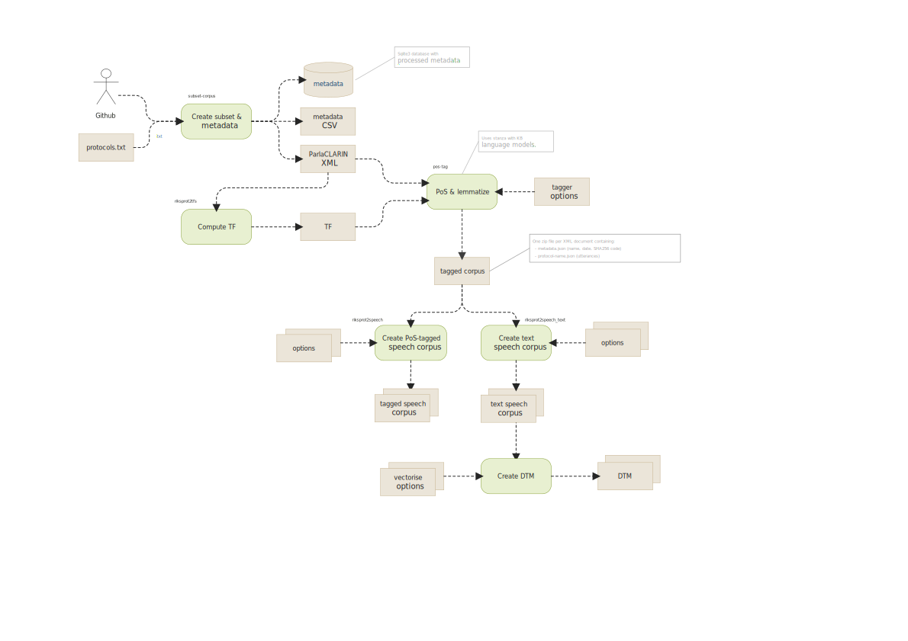

# SweDeb Sample Data

This repository contains sample datasets used for Swe-DEB testing and quality control.

## Description



Each dataset is structured as follows:

```
├── dehyphen_datadir
│   ├── ... files created by dehyphenation process
│   └── word-frequencies.pkl
├── logs
│   ├── ...
│   └── execution logs with options used when data was generated
├── Makefile
├── opts
│   ├── corpus-configs
│   │   ├── ... corpus configuration files for generating model(s)
│   │   └── corpus-config.yml
│   ├── dtm
│   │   ├── ... each file contains options for creating a DTM
│   │   ├── XYZ.yml ==> assumes existens of ./speeches/tagged_frames_speeches_XYZ.feather
│   │   └── text.yml
│   ├── plain-text-speeches
│   │   ├── ... each file contains options for creating a plain text speech corpus
│   │   ├── text_speeches_base.yml
│   │   └── text_speeches_dedent_dehyphen.yml
│   ├── tagged-speeches
│   │   ├── ... each file contains options for creating a PoS-tagged speech corpus
│   │   └── tagged_frames_speeches_text.feather.yml
│   └── tagger-config.yml
│         => ... specifies options for PoS tagging and lemmatization
├── protocols.txt
└── v0.6.0
    ├── dehyphen_datadir
    ├── dtm
    │   ├── dtm_base_text
    │   │   ├── dtm_base_text_document_index.csv.gz => document index
    │   │   ├── dtm_base_text_token2id.json.gz => vocabulary
    │   │   ├── dtm_base_text_vector_data.npz => DTM sparse matrix
    │   │   └── dtm_base_text_vectorizer_data.json => stored options
    │   └── ... DTMs generated from options above
    ├── parlaclarin
    │   ├── metadata
    │   │   ├── ... => riksprot metadata downloaded from Github
    │   │   ├── ...  * generated data
    │   │   ├── alias.csv
    │   │   ├── government.csv
    │   │   ├── ...
    │   │   ├── unknowns.csv
    │   │   ├── utterances.csv
    │   │   └── * is generated data
    │   └── protocols
    │       ├── ...
    │       └── ParlaCLARIN protocol structure that mirrors Github
    ├── riksprot_metadata.db
    │       └── ... processed Sqlite3 metadata database
    ├── speeches
    │   ├── ... => speech corpora generated from options above
    │   ├── text_speeches_base.zip
    │   └── text_speeches_dedent_dehyphen.zip
    └── tagged_frames
    │   └── ... tagged version of ParlaCLARIN protocols
    └── vrt
    │   └── ... vertical text version of tagged frames (with structural tags)
    └── cwb
        └── ... Corpus Workbench data folder
    └── registry
        └── ... Corpus Workbench registry (update folder paths!)

```

## How to generate a new dataset

### Prerequisites

You first need to install the following python libraries

 - ...

### Steps

0. Clone this repository and install required libraries.

1. Create a new data folder these and copy folder `opts` and files `.env`, `Makefile` and `protocols.txt` from (the root of) an existing dataset as a starting-point.

```
% mkdir data/dataset-xy
% cp -r data/dataset-01/{opts, Makefile,.env,protocols.txt} data/dataset-xy/
```

2. Edit `protocols.txt` and make sure it contains the protocols you wish to include in the dataset.

3. Edit the files in the `opts` directory so that it contents reflects the data and models to be included in the project.
 - Each options file added to folder `dataset-xy/opts/dtm` will generate a corresponding DTM.
 The options added to these must be a valid CLI options to `humlab-penelope:vectorize` or `humlab-penelope:vectorize-id` (see help page)

4. Edit `.env` and set `CORPUS_VERSION` and `METADATA_VERSION` to the target ParlaCLARIN version.

5. Use `make` to create the entire dataset, or run any of the individual recipies:

```
% make dataset
```

## Usage

### DTM corpus

Each DTM corpus is stored in four separate files, each having the same *prefix*. Apart from grouping the files together, the prefix usually also indicates significant features of the specific corpus and is a free-text option assigned at generation.
Typically, the DTM is also stored in a folder named *prefix*.

You can generate new DTMs using the `vectorize` CLI in the `humlab-penelope` Python package.

Example corpus with prefix `dtm_lemma`

```
 ├── dtm_lemma
 │   ├── dtm_lemma_document_index.csv.gz    => Index of documents with metadata
 │   ├── dtm_lemma_token2id.json.gz         => Vocabulary, term-to-token mapping in JSON format.
 │   ├── dtm_lemma_vector_data.npz          => DTM as an SciPy sparse matrix
 │   └── dtm_lemma_vectorizer_data.json     => Stored options used when DTM was generated
```

The `humlab-penelope` Python package contains some classes that simplifies working with an DTM. You can install the package using `pip install humlab-penelope` in a fresh environment. The main classes of interest are `VectorizedCorpus` and `Token2Id`.

```python
>> from penelope.corpus import VectorizedCorpus

tag: str = "lemma"
folder: str = "data/lemma"

corpus: VectorizedCorpus = VectorizedCorpus.load(folder=tag, tag=tag)

print(f"Corpus has {corpus.shape[0]} documents and {corpus.shape[1]} types")
print(f"Columns in document index: {corpus.document_index.columns.tolist()}")

assert 'gender_id' in corpus.document_index.columns
assert 'party_id' in corpus.document_index.columns
assert 'office_type_id' in corpus.document_index.columns

corpus.document_index
corpus.token2id
corpus.id2token
```

The `VectorizedCorpus` class has functions for grouping and slicing the DTM, functions for finding words, storing etc.

```python
>> corpus.find_matching_words({"nedrustning*"}, 99)

```

Grouping by a temporal key and a pivot key:

```python
>>> gender_by_year_corpus: VectorizedCorpus = corpus.group_by_pivot_keys(
    temporal_key="year",
    pivot_keys=["gender_id"],
    filter_opts=None,
    document_namer=None,
    fill_gaps=False,
    aggregate='sum',
)

>>> gender_by_year_corpus.shape
(13, 8560)

```

### Working with metadata

Easiest way of working with metadata is by using the `Codecs` class in `welfare_state_analytics` Python package (`pip install`). (This class will be moved to a separate `pyswedeb` package).

Working with code tables:

```python

METADATA_FILENAME: str = './tests/test_data/riksprot/main/riksprot_metadata.db'
EXPECTED_TABLES: set[str] = {
    'chamber',
    'gender',
    'office_type',
    'sub_office_type',
    'persons_of_interest',
    'government',
    "party",
}

from westac.riksprot.parlaclarin import codecs as md

data: md.Codecs = md.Codecs().load(source=METADATA_FILENAME)

assert set(data.tablenames().keys()) == (EXPECTED_TABLES - {'persons_of_interest'})

```

Working with persons (`PersonCodecs` is derived from `Codecs`):

```python

person_codecs: md.PersonCodecs = md.PersonCodecs().load(source=METADATA_FILENAME)

assert issubclass(md.PersonCodecs, md.Codecs)

assert person_codecs.pid2person_id.get(2) == 'Q5005171'
assert person_codecs.person_id2pid.get('Q5005171') == 2
assert person_codecs.pid2person_name.get(2) == 'Börje Hörnlund'
assert person_codecs.person_id2name.get('Q5005171') == 'Börje Hörnlund'


```

### Working with speech texts

```python
import westac.riksprot.parlaclarin.speech_text as sr

TAGGED_CORPUS_FOLDER = "/path/to/tagged/corpus/used/to/generate/dtm
repository: sr.SpeechTextRepository = sr.SpeechTextRepository(
    source=TAGGED_CORPUS_FOLDER,
    person_codecs=person_codecs,
    document_index=corpus.document_index,
)

document_name: str = "document_name that exists in corpus.document_index.document_name"

speech = repository.speech(speech_name=document_name, mode='dict')

print(speech)

```

FIXME: Generate and publish penelope API documentation.

### DTM corpus generation options

These are the avaliable options that can be specified in a file in the `dataset-zy/opts` folder.
```man
Usage: vectorize args [OPTIONS] CONFIG_FILENAME INPUT_FILENAME OUTPUT_FOLDER OUTPUT_TAG

Options:
  --append-pos                    Append PoS to tokens
  --deserialize-processes INTEGER RANGE
                                  Number of processes during deserialization
                                  [1<=x<=99]
  --filename-pattern TEXT         Filename pattern
  --keep-numerals / --no-keep-numerals
                                  Keep numerals
  --keep-symbols / --no-keep-symbols
                                  Keep symbols
  --lemmatize / --no-lemmatize    Use word baseforms
  --max-tokens INTEGER            Only consider the `max-tokens` most frequent
                                  tokens
  --max-word-length INTEGER RANGE
                                  Max length of words to keep  [10<=x<=99]
  --min-word-length INTEGER RANGE
                                  Min length of words to keep  [1<=x<=99]
  --options-filename TEXT         Use values in YAML file as command line
                                  options.
  --phrase-file TEXT              Phrase filename
  --phrase TEXT                   Phrase
  --pos-excludes TEXT             POS tags to exclude.
  --pos-includes TEXT             POS tags to include e.g. "|NN|JJ|".
  --pos-paddings TEXT             POS tags to replace with a padding marker.
  --remove-stopwords [swedish|english]
                                  Remove stopwords using given language
  --tf-threshold-mask             If true, then low TF words are kept, but
                                  masked as "__low_tf__"  [1<=x<=99]
  --tf-threshold INTEGER RANGE    Globoal TF threshold filter (words below
                                  filtered out)  [1<=x<=99]
  --only-alphabetic               Keep only tokens having only alphabetic
                                  characters
  --only-any-alphanumeric         Keep tokens with at least one alphanumeric
                                  char
  --enable-checkpoint / --no-enable-checkpoint
                                  Enable checkpoints
  --force-checkpoint / --no-force-checkpoint
                                  Force new checkpoints (if enabled)
  --to-lower / --no-to-lower      Lowercase words
  --help                          Show this message and exit.
```

### Generate VRT corpus (input to CWB)


